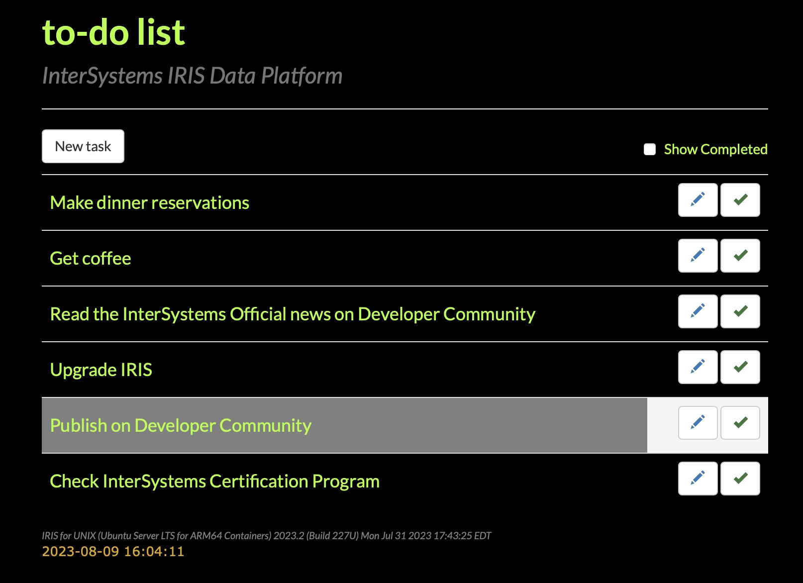

# todo-list web app
#### freely inspired by Michael Smart ; thanks to him
https://github.com/intersystems/building-modern-web-apps

__Description:__ An example of a RESTful web service as implemented in IRIS, and a client application designed in Angular.js that connects to the service. The two components are meant to demonstrate the concepts of modern web application design and serve as a companion piece to the presentation found here: https://learning.intersystems.com/course/view.php?id=681

__Requirements:__ any version of IRIS ; otherwise, Caché or Ensemble 2016.2

__Instructions:__

1. `docker compose build --no-cache`
2. `docker compose up -d`
3. Open your web browser to http://localhost:32773/front-end/index.html
4. Play with the /front-end/api through http://localhost:32773/swagger-ui/index.html

# Demo

